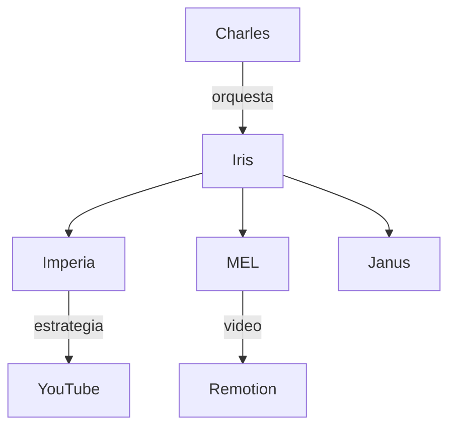
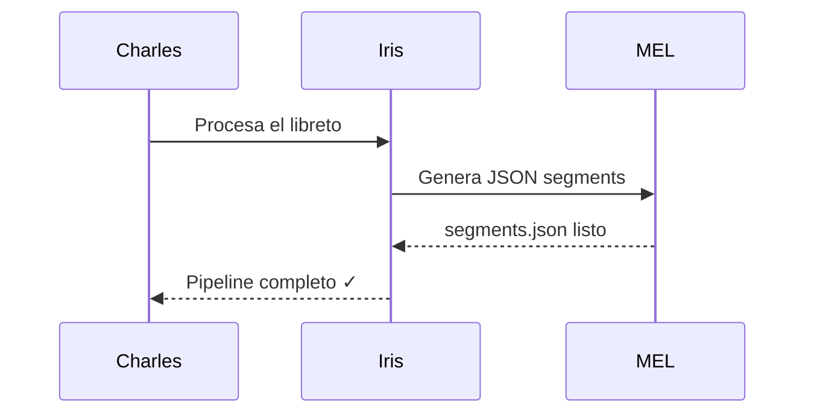

# Markdown — Referencia Completa

> Documento de demostración con todas las variantes del lenguaje Markdown.
> Ideal para probar renderers, temas de blog, y editores como StackEdit.

---

## 1. Encabezados

# h1 — Encabezado nivel 1
## h2 — Encabezado nivel 2
### h3 — Encabezado nivel 3
#### h4 — Encabezado nivel 4
##### h5 — Encabezado nivel 5
###### h6 — Encabezado nivel 6

Sintaxis alternativa para h1 y h2:

Título nivel 1
==============

Título nivel 2
--------------

---

## 2. Énfasis y formato de texto

**Negrita con doble asterisco**
__Negrita con doble guión bajo__
*Cursiva con un asterisco*
_Cursiva con guión bajo_
***Negrita y cursiva combinadas***
~~Tachado con doble tilde~~
`Código inline con backtick`
<u>Subrayado con HTML</u>
<mark>Texto resaltado / highlight con HTML</mark>
Texto normal con ^superíndice^ (si el renderer lo soporta)
Texto normal con ~subíndice~ (si el renderer lo soporta)

---

## 3. Reemplazos tipográficos

Con la opción `typographer` activada en markdown-it y similares:

- Copyright: (c) → ©
- Registered: (r) → ®
- Trademark: (tm) → ™
- Section: (p) → §
- Plus-minus: +- → ±
- Comillas tipográficas: "hola" → "hola"
- Em dash: --- → —
- En dash: -- → –
- Elipsis: ... → …

---

## 4. Blockquotes (citas)

> Esta es una cita simple de un solo nivel.

> Las citas también pueden tener **formato interno**,
> incluir `código`, listas, y más.

> Citas anidadas de primer nivel…
>
> > …segundo nivel con `>>`…
> >
> > > …tercer nivel con `>>>`.

> **Tip:** Puedes mezclar cualquier elemento Markdown dentro de una cita.

---

## 5. Listas

### Lista desordenada (bullets)

- Elemento con guión
- Otro elemento
  - Sub-elemento con indentación
  - Otro sub-elemento
    - Tercer nivel de anidación
- Último elemento

También con asterisco:

* Primer elemento
* Segundo elemento
* Tercer elemento

Y con símbolo `+`:

+ Opción A
+ Opción B
+ Opción C

### Lista ordenada (numerada)

1. Primer paso
2. Segundo paso
3. Tercer paso
   1. Sub-paso 3.1
   2. Sub-paso 3.2
4. Cuarto paso

### Lista de tareas (Task List)

- [x] Tarea completada
- [x] Otra tarea lista
- [ ] Tarea pendiente
- [ ] Por hacer todavía

---

## 6. Código

### Código inline

Usa `console.log()` para depurar en JavaScript.
El comando `git status` muestra el estado del repositorio.

### Bloque de código sin lenguaje

```
Este es un bloque de código
sin resaltado de sintaxis.
Preserva espacios  y    tabulaciones.
```

### Bloques con resaltado de sintaxis

**JavaScript:**
```javascript
const greet = (name) => {
  return `Hola, ${name}!`;
};

console.log(greet("Charles"));
```

**Python:**
```python
def fibonacci(n):
    a, b = 0, 1
    for _ in range(n):
        yield a
        a, b = b, a + b

print(list(fibonacci(10)))
```

**Bash / Shell:**
```bash
#!/bin/bash
echo "Iniciando pipeline..."
claude -p "Procesa esto" --output resultado.md
echo "Listo ✓"
```

**JSON:**
```json
{
  "canal": "Famosos AD",
  "plataforma": "YouTube",
  "agentes": ["Iris", "Imperia", "MEL"],
  "activo": true
}
```

**HTML:**
```html
<!DOCTYPE html>
<html lang="es">
  <head>
    <meta charset="UTF-8" />
    <title>Demo</title>
  </head>
  <body>
    <h1>Hola mundo</h1>
  </body>
</html>
```

**CSS:**
```css
.tarjeta {
  display: flex;
  border-radius: 8px;
  box-shadow: 4px 4px 0 #000;
  background: #fff;
  padding: 1rem;
}
```

---

## 7. Tablas

### Tabla básica

| Opción    | Descripción                                      |
| --------- | ------------------------------------------------ |
| `data`    | Ruta al archivo de datos del template.           |
| `engine`  | Motor de templates. Handlebars por defecto.      |
| `ext`     | Extensión para los archivos de destino.          |

### Alineación de columnas

| Izquierda | Centro       | Derecha  |
| :-------- | :----------: | -------: |
| Item A    | Item B       | $100.00  |
| Item C    | Item D       | $250.50  |
| Item E    | Item F       | $1,200.00|

### Tabla con formato interno

| Nombre      | Tipo        | Estado      |
| ----------- | ----------- | ----------- |
| **Iris**    | Orchestrator| ✅ Activo   |
| *Imperia*   | YouTube     | ✅ Activo   |
| `MEL`       | JSON/Video  | 🔄 En build |
| ~~Janus~~   | Scraper     | ⏸ Pausado  |

---

## 8. Links e hipervínculos

[Enlace inline básico](https://tvimperia.com)

[Enlace con título tooltip](https://tvimperia.com "TVImperia — Sitio oficial")

[Enlace de referencia][referencia-1]

[Otra referencia con texto diferente][ref-yt]

[referencia-1]: https://tvimperia.com
[ref-yt]: https://youtube.com

URL automática: <https://tvimperia.com>

Email automático: <charles@tvimperia.com>

---

## 9. Imágenes

### Imagen inline básica


### Imagen con texto alternativo y título


### Imagen como referencia

![Imagen referenciada][img-ref]

[img-ref]: https://i.imgur.com/KfbIBt9.png "Referencia de imagen"

### Imagen como enlace (imagen clickeable)

[](https://tvimperia.com)

---

## 10. Líneas horizontales (separadores)

Con guiones:

---

Con asteriscos:

***

Con guiones bajos:

___

---

## 11. Saltos de línea y párrafos

Este es un párrafo normal. Al dejar una línea en blanco,
comienza un nuevo párrafo aunque el texto esté en la misma sección.

Este es el segundo párrafo.

Para un salto de línea **dentro** del mismo párrafo,
agrega dos espacios al final de la línea (como aquí arriba).

O usa la etiqueta HTML:
Primera línea.<br>Segunda línea en el mismo párrafo.

---

## 12. HTML inline

Markdown permite embeber HTML directamente:

<details>
<summary>🔍 Haz clic para expandir</summary>

Este contenido está oculto por defecto.
Se revela al hacer clic en el `<summary>`.

```javascript
// Incluso puedes poner código aquí dentro
const secret = "¡Encontraste el easter egg!";
```

</details>

<br>

<kbd>Ctrl</kbd> + <kbd>C</kbd> — Copiar
<kbd>Ctrl</kbd> + <kbd>V</kbd> — Pegar
<kbd>Cmd</kbd> + <kbd>Z</kbd> — Deshacer

---

## 13. Notas al pie (Footnotes)

Aquí hay una afirmación importante[^1] que necesita referencia.

También puedes tener notas más largas[^nota-larga].

[^1]: Esta es la nota al pie número 1. Aparece al final del documento.
[^nota-larga]: Esta nota es más larga y puede tener múltiples párrafos.

    Segundo párrafo de la nota larga, indentado con 4 espacios.

---

## 14. Definiciones (Definition Lists)

Algunos renderers soportan listas de definición:

Markdown
:   Lenguaje de marcado ligero creado por John Gruber en 2004.

HTML
:   HyperText Markup Language. El lenguaje base de la web.

YAML
:   YAML Ain't Markup Language. Formato de serialización legible.

---

## 15. Abreviaciones

Algunos renderers convierten abreviaciones automáticamente:

HTML, CSS, JS y API son términos comunes en desarrollo web.

*[HTML]: HyperText Markup Language
*[CSS]: Cascading Style Sheets
*[JS]: JavaScript
*[API]: Application Programming Interface

---

## 16. Matemáticas (si el renderer lo soporta)

Inline math: $E = mc^2$

Bloque de ecuación:

$$
\int_{-\infty}^{\infty} e^{-x^2} dx = \sqrt{\pi}
$$

$$
f(x) = \frac{1}{\sigma\sqrt{2\pi}} e^{-\frac{(x-\mu)^2}{2\sigma^2}}
$$

---

## 17. Diagramas Mermaid (si el renderer lo soporta)





---

## 18. Escape de caracteres especiales

Para mostrar caracteres Markdown literalmente, usa `\`:

\*No es cursiva\*
\*\*No es negrita\*\*
\# No es encabezado
\[No es un link\]
\`No es código\`
\> No es cita

---

## 19. Comentarios en Markdown

Los comentarios HTML son invisibles en el render:

<!-- Este es un comentario que no se muestra en el output -->

<!--
  Comentario
  de múltiples
  líneas
-->

Texto visible antes y después del comentario.

---

## 20. Resumen de sintaxis

| Elemento         | Sintaxis Markdown              |
| ---------------- | ------------------------------ |
| Negrita          | `**texto**` o `__texto__`      |
| Cursiva          | `*texto*` o `_texto_`          |
| Tachado          | `~~texto~~`                    |
| Código inline    | `` `código` ``                 |
| Encabezado       | `# H1` `## H2` `### H3`        |
| Enlace           | `[texto](url)`                 |
| Imagen           | ``                  |
| Cita             | `> texto`                      |
| Lista bullet     | `- item` o `* item`            |
| Lista numerada   | `1. item`                      |
| Tarea            | `- [x] hecho` `- [ ] pendiente`|
| Código bloque    | ` ```lenguaje ``` `            |
| Separador        | `---` o `***`                  |
| Tabla            | `\| col \| col \|`             |
| Nota al pie      | `[^1]`                         |

---

*Generado por Iris · TVImperia © 2026*
