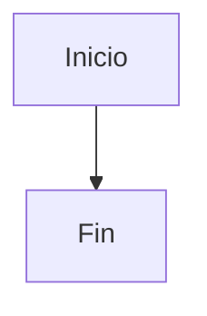

# Mermaid

Feature prevista para renderizar diagramas Mermaid dentro de VeloxMD.

## Sintaxis candidata

El formato principal deberia ser code fence:

````md

````

## Decision de organizacion

Mermaid debe vivir aqui, no dentro de la app desktop. La app puede activar o configurar la feature en el futuro, pero el parseo y el render pertenecen al engine.

## Puntos que debe resolver la implementacion futura

- Render en `static`: mostrar diagrama.
- Render en `source`: preservar bloque Markdown editable.
- Render en `hybrid`: mostrar diagrama cuando el bloque no este enfocado y revelar fuente al editar.
- Carga de la libreria Mermaid sin acoplar VeloxMD a Tauri.
- Manejo seguro de errores de sintaxis.
- Tests con fences validos, invalidos y documentos con multiples diagramas.

## Estado

Scaffold de organizacion. Sin runtime activo.
